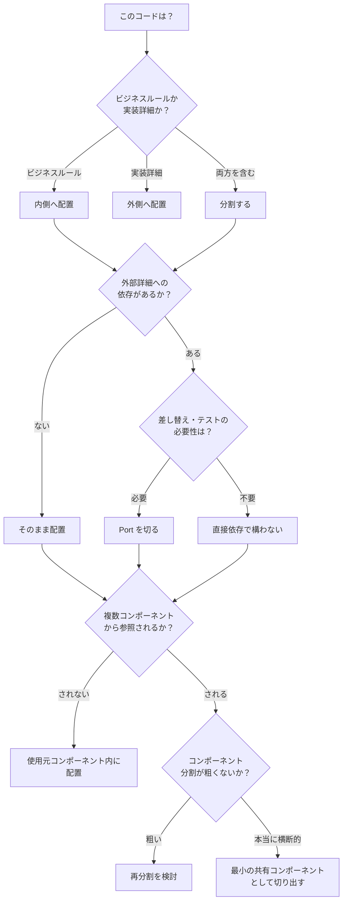

# Clean Architecture Principles

## 目的

この Skill は、クリーンアーキテクチャを「図の模倣」ではなく、次の原則として運用するための実務ガイドです。バックエンド・フロントエンドを問わず適用する。

> ビジネスルールを実装詳細から守り、依存の方向を内側に向け続ける。

## いつ使うか

- クリーンアーキテクチャを導入・改善したいとき
- 「4 層にしたのに複雑化した」と感じるとき
- interface や DTO が増えすぎているとき
- 「この責務はどこに置くべきか」で迷うとき
- 設計レビューで、原則違反か規約違反かを切り分けたいとき

## 実行手順

### 1) まず原則を固定する

最初に明文化すること:

- 守る対象: ビジネスルール
- 変わりやすい対象: DB、UI、フレームワーク、外部 API
- 不変条件: ソース依存は内側へ向かう

この 3 点を曖昧にしたまま、レイヤー名やフォルダ名を決めない。

### 2) 「形式」ではなく「境界」を特定する

次の境界だけを先に決める:

- ビジネスルールの内側
- 実装詳細の外側
- 依存性逆転が必要な接点（Port）

すべての層間に機械的に interface を置かない。外部詳細を差し替える必要がある接点だけに置く。

### 3) 依存違反を検出する

以下を違反候補として扱う:

- 内側コードが ORM モデルや Web フレームワーク型を直接 import
- ユースケースが外部 I/O 仕様（HTTP request/response 型）に拘束
- 「Controller -> Service -> Repository」を通すためだけの薄い委譲

具体的な違反パターンと修正例は `references/violation-examples.md` を参照。

### 4) 抽象化コストを評価する

interface を追加する前に、必ず次を確認:

- その境界は将来の差し替え可能性が高いか
- テスト容易性の改善が明確か
- 追加される複雑性（実装数、変換、追跡コスト）に見合うか
- **パフォーマンスへの影響**: その間接層はホットパス上にあるか。変換コストが許容範囲か

見合わないなら抽象化しない。

**パフォーマンスと原則のトレードオフ**: 間接層やオブジェクト変換はランタイムコストを伴う。以下の判断基準で対処する:

- ホットパス（高頻度実行・低レイテンシ要求）上で間接層のコストが計測可能なレベルで問題になる場合、**その箇所に限り**直接依存を許容する
- 許容する場合は、その理由をコードコメントで明示し、影響範囲を局所に留める
- 「パフォーマンスが悪くなるかもしれない」という推測ではなく、**計測に基づいて判断する**。推測で原則を破らない

### 5) 迷いを設計入力として扱う

「どこに書くべきか迷う」状態は失敗ではない。次を問う:

- 責務はどこに属するか
- 依存方向は維持できるか
- その分割はドメイン理解を深めるか、隠すか

レイヤー規約に押し込んで議論を終わらせない。

## 配置の判断フロー

「このコードはどこに置くべきか？」で迷ったとき:



### 配置チェックリスト（判断フローの補完）

判断フローと併用する。コードを配置したあとに、以下をすべて確認する:

- [ ] このコードの責務は1つに絞られているか？
- [ ] 依存方向は内側（方針）に向いているか？
- [ ] 外部詳細（FW型、ORM、HTTP仕様）を直接 import していないか？
- [ ] interface を置いたなら、その理由を「差し替え」か「テスト容易性」で説明できるか？
- [ ] 通る必要のない中間層を経由していないか？
- [ ] `shared` / `common` に逃げていないか？ドメインに属するなら属すべき場所へ
- [ ] 横断的関心事（ログ、認証、エラーハンドリング）をビジネスルールに混入させていないか？（`references/cross-cutting-concerns.md` 参照）

## プロジェクト固有ルールとの関係

この Skill は**原則**を定義する。プロジェクトごとのディレクトリ規約・テスト規約・コーディング規約はこの原則の**具現化**であり、矛盾した場合は原則に立ち返って判断する。

- ディレクトリルールが「技術駆動分割を禁止」しているなら、それはこの原則の帰結
- テストルールが「振る舞いに焦点を当てる」なら、それはこの原則と補完関係にある（詳細は `references/testing-and-architecture-boundaries.md`）
- 規約の存在理由が説明できないなら、規約側を見直す

## レビュー時の出力フォーマット

設計レビューや相談への回答は以下で返す。

```markdown
## 判定

- 原則適合: [High / Medium / Low]
- 主な懸念: [1 文]

## 依存方向チェック

- [ ] 内側が外側詳細を参照していない — [Must Fix / Should Fix / Consider]
- [ ] 境界で依存性逆転が成立している — [Must Fix / Should Fix / Consider]
- [ ] フレームワーク型がビジネスルールへ侵入していない — [Must Fix / Should Fix / Consider]
- [ ] 横断的関心事がビジネスルールと分離されている — [Must Fix / Should Fix / Consider]

## 過剰構造チェック

- [ ] 目的のない interface がない — [Must Fix / Should Fix / Consider]
- [ ] 目的のない DTO 変換がない — [Must Fix / Should Fix / Consider]
- [ ] 薄い委譲チェーンだけの層がない — [Must Fix / Should Fix / Consider]

## 推奨アクション

1. [Must Fix] [修正内容] — 根拠: [該当する原則/リファレンス名]
2. [Should Fix] [修正内容] — 根拠: [該当する原則/リファレンス名]
3. [Consider] [修正内容] — 根拠: [該当する原則/リファレンス名]
```

重要度の定義:
- **Must Fix**: 依存方向の違反、またはビジネスルールの保護が破れている。マージ前に修正が必要
- **Should Fix**: 過剰構造や配置の問題。現状動作するが、保守性に影響する
- **Consider**: 改善の余地がある。別タスクとして検討する価値がある

## 適用すべきでない場合

クリーンアーキテクチャは万能ではない。以下の状況では、適用しない判断が正しい。

- **プロトタイプ / 使い捨てスクリプト**: 寿命が短いコードに境界設計のコストをかける意味がない
- **ビジネスルールがほぼ存在しない単純 CRUD**: 守るべき「内側」がないなら、依存方向の制御は過剰。フレームワークの規約に素直に従うほうが生産的
- **チームが原則を共有していない段階での一括導入**: 形式だけが先行し、「なぜこう分けるのか」が説明できない状態になる。まず原則の共有から始め、段階的に適用する
- **変更頻度が極めて低い安定したコード**: 差し替え可能性も拡張性も不要なら、間接層を入れるコストが回収されない

「適用しない」と「まだ適用しない（段階的に導入する）」は異なる。前者はプロジェクト特性による判断であり、後者はチーム成熟度による判断である。

## 禁止事項

- 「4 層に分けること」をゴールにしない
- 「interface を作ったか」で設計の良し悪しを判定しない
- クリーンアーキテクチャと DDD を同一視しない
- 「迷いを減らすため」だけに責務配置を固定しない

## AI エージェントが使用する際のガードレール

### 判断の確信度が低いとき

設計判断が五分五分で割れる場合、自力で決定せずユーザーに選択肢を提示する:

```
この配置には2つの妥当な選択肢があります:
A: [選択肢Aとその根拠]
B: [選択肢Bとその根拠]
トレードオフ: [AとBの差分]
→ どちらを採用しますか？
```

「原則に従えば A が正しい」と断定できないなら、断定しない。

### 過剰な改修提案の抑制

レビューや設計相談で違反を検出しても、**今のタスクの範囲外の大規模リファクタリングを提案しない**。以下を守る:

- 今触っているコードの範囲内で直せる違反 → 修正を提案する
- 影響範囲が広く別タスクが必要な違反 → 違反の記録と別タスク化を提案する
- 設計判断が必要な違反 → 判断材料を提示し、ユーザーに委ねる

### 漸進的改善の原則

違反を検出したとき、一度に全部直そうとしない。以下の優先順位で対応する:

1. **即時修正**: 依存方向の違反で、今触っているファイル内で完結する修正
2. **タスク化**: 影響範囲が今のファイルを超える修正。違反箇所と修正方針を記録し、別タスクとして提案する
3. **設計相談**: 「そもそも境界の引き方が間違っている可能性がある」レベルの問題。判断材料を提示し、ユーザーと議論する

「原則に従って全部リファクタリングしましょう」は禁止。段階的に改善する。

## 追加リファレンス

- **コンポーネントパッケージング**: `references/component-packaging.md`  
  レイヤーパッケージングの不採用、コンポーネント単位での外向き公開（インターフェースのみ）、`shared` の原則禁止、境界横断時の境界見直しを定義する。

- **違反パターンと修正例**: `references/violation-examples.md`  
  よくある依存違反・過剰構造の Before/After コード例。バックエンド（Java）とフロントエンド（TypeScript）の両方を含む。

- **テスト戦略とアーキテクチャ境界**: `references/testing-and-architecture-boundaries.md`  
  Port の位置がモック境界と一致する原則、ピュアなロジックのモック不要テスト、コンポーネント単位のテスト境界を定義する。

- **フロントエンドへの適用**: `references/frontend-clean-architecture.md`  
  フロントエンド固有の適用方法。バックエンドとの地続き構造、関心ベクトルの独立性、ディレクトリ構造への反映を定義する。

- **バックエンドへの適用**: `references/backend-clean-architecture.md`  
  バックエンド固有の適用方法。DI コンテナとの関係、永続化層の境界、外部サービス統合、ユースケースの粒度を定義する。

- **横断的関心事の扱い方**: `references/cross-cutting-concerns.md`  
  ログ、認証/認可、エラーハンドリング、トランザクション管理など、レイヤーを横断する関心事の配置原則を定義する。
