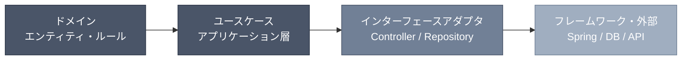

# バックエンドにおけるクリーンアーキテクチャ

> **この原則は特定のフレームワークに依存しない。** Spring Boot / Django / FastAPI / Express など、いずれのフレームワークでも同様に適用できる。フレームワーク固有の例は、後述のセクションで明示的に分離して示す。

## 前提

バックエンドは、システム全体のクリーンアーキテクチャにおいて**ドメインを直接抱える**位置にある。フロントエンドより原則の適用が素直だが、フレームワークへの過度な依存という落とし穴が常に存在する。



**フレームワークは最外縁の実装詳細であり、ビジネスルールを知ってはならない。** これが守られていれば、フレームワークの置き換えはビジネスロジックに一切触れずに行える。

---

## DI コンテナとの関係

フレームワークの DI（`@Service`, `@Autowired`, Spring の `@Bean`）は**配線手段**に過ぎない。ビジネスルールがこれらのアノテーションに依存することは、依存方向の違反だ。

### Before（NG）: ユースケースがフレームワークに依存

```java
// ビジネスロジックが Spring に拘束されている
@Service
public class TransferMoneyUseCase {

    @Autowired
    private AccountRepository repository; // フレームワークのアノテーション

    @Transactional
    public void execute(TransferCommand command) { ... }
}
```

`@Service`, `@Autowired`, `@Transactional` は Spring の概念だ。このクラスは Spring なしでインスタンス化できない。

### After（OK）: ユースケースはプレーンなクラス

```java
// ユースケースはフレームワーク非依存
public class TransferMoneyUseCase {

    private final AccountRepository repository; // インターフェースへの依存のみ

    public TransferMoneyUseCase(AccountRepository repository) {
        this.repository = repository;
    }

    public void execute(TransferCommand command) { ... }
}

// 配線はフレームワーク側が担う（Configクラス等）
@Configuration
public class UseCaseConfig {
    @Bean
    public TransferMoneyUseCase transferMoneyUseCase(AccountRepository repo) {
        return new TransferMoneyUseCase(repo);
    }
}
```

**原則: ユースケースはプレーンなクラスとして書け。フレームワークなしでもインスタンス化できるべきだ。**

---

## 永続化層の境界

### Port（インターフェース）の切り方

リポジトリのインターフェースはドメイン層に置き、実装（JPA・SQLAlchemy 等）はアダプタ層に置く。

```java
// ドメイン層: インターフェース（Port）
public interface AccountRepository {
    Optional<Account> findById(AccountId id);
    void save(Account account);
}

// アダプタ層: JPA による実装（Adapter）
@Repository
public class JpaAccountRepository implements AccountRepository {
    private final AccountJpaRepository jpa; // Spring Data JPA

    @Override
    public Optional<Account> findById(AccountId id) {
        return jpa.findById(id.value()).map(AccountMapper::toDomain);
    }
}
```

### Entity モデル ≠ ドメインモデル の整理

| 状況 | 判断 |
|---|---|
| DB スキーマとドメインの構造が一致している | 分けなくてよい。過剰な変換は害 |
| DB の正規化・非正規化がドメインと乖離している | 分ける。JPA Entity とドメイン Entity を別クラスにする |
| ドメインモデルに永続化の詳細（`@Column`, `@Id`）が混入している | 分ける |

**Before（NG）: ドメインモデルに JPA アノテーションが混入**

```java
@Entity
@Table(name = "accounts")
public class Account { // これはドメインモデルか JPA Entityか区別がつかない
    @Id
    private Long id;
    @Column(name = "balance_amount")
    private BigDecimal balance;
    @Version
    private Long version; // 永続化の都合
}
```

**After（OK）: ドメインモデルと JPA Entity を分離**

```java
// ドメインモデル（永続化を知らない）
public class Account {
    private final AccountId id;
    private Money balance;

    public void withdraw(Money amount) { ... } // ビジネスルール
}

// JPA Entity（ドメインを知らない）
@Entity
@Table(name = "accounts")
class AccountJpaEntity {
    @Id
    Long id;
    BigDecimal balanceAmount;
}
```

**Python の場合（FastAPI + SQLAlchemy）**

```python
# ドメインモデル（Pydantic や dataclass でも可、ORM 非依存）
@dataclass
class Account:
    id: AccountId
    balance: Money

    def withdraw(self, amount: Money) -> None: ...

# SQLAlchemy モデル（永続化の詳細）
class AccountORM(Base):
    __tablename__ = "accounts"
    id: Mapped[int] = mapped_column(primary_key=True)
    balance_amount: Mapped[Decimal]
```

---

## 外部サービス統合

外部 API クライアントのレスポンス型がドメインに直接伝播すると、外部サービスの変更がドメインを汚染する。Adapter でドメイン型に変換し、境界を切る。

**Before（NG）: 外部型がドメイン層まで伝播**

```java
// ユースケースが Stripe の型を直接扱っている
public class ProcessPaymentUseCase {
    public void execute(PaymentCommand cmd) {
        StripeChargeResponse response = stripeClient.charge(...); // 外部型
        if (response.getStatus().equals("succeeded")) { ... }    // 外部の都合
    }
}
```

**After（OK）: Adapter でドメイン型に変換**

```java
// ドメイン型（外部を知らない）
public record PaymentResult(PaymentStatus status, PaymentId id) {}

// Adapter: 外部型 → ドメイン型
public class StripePaymentGateway implements PaymentGateway {
    @Override
    public PaymentResult charge(PaymentCommand cmd) {
        StripeChargeResponse res = stripeClient.charge(...);
        return new PaymentResult(
            res.getStatus().equals("succeeded") ? SUCCEEDED : FAILED,
            new PaymentId(res.getId())
        );
    }
}

// ユースケースはドメイン型のみを扱う
public class ProcessPaymentUseCase {
    public void execute(PaymentCommand cmd) {
        PaymentResult result = paymentGateway.charge(cmd);
        if (result.status() == SUCCEEDED) { ... }
    }
}
```

**原則: ユースケースはポートのインターフェース越しに外部と話す。外部ライブラリの型はアダプタの外に出さない。**

---

## ユースケースの粒度

### 1 ユースケース = 1 操作

ユースケースは「アプリケーションが何をできるか」の単一エントリポイントだ。複数操作をまとめた「サービスクラス」はしばしば肥大化し、責務が曖昧になる。

**Before（NG）: 操作を詰め込んだサービスクラス**

```java
@Service
public class AccountService {
    public void open(OpenAccountCommand cmd) { ... }
    public void close(CloseAccountCommand cmd) { ... }
    public void transfer(TransferCommand cmd) { ... }
    public AccountStatement getStatement(AccountId id) { ... }
}
```

**After（OK）: 1 操作 = 1 クラス**

```java
public class OpenAccountUseCase { ... }
public class CloseAccountUseCase { ... }
public class TransferMoneyUseCase { ... }
public class GetAccountStatementUseCase { ... }
```

### 共通ロジックの抽出先

| 共通ロジックの性質 | 抽出先 |
|---|---|
| ドメインのルール（制約・計算）| ドメインサービス or エンティティのメソッド |
| 複数ユースケースをまたぐ手続き | ドメインサービス |
| 特定ユースケースの内部整理 | ユースケース内のプライベートメソッド |
| 永続化やメッセージング操作 | リポジトリ・Adapter に委譲 |

ドメインサービスはドメイン層に属し、フレームワークや DB を知らない。ユースケース内ヘルパーはあくまでそのユースケース内に閉じる。

---

## ディレクトリ構造例

### Java（コンポーネントパッケージング）

ドメインの関心（コンポーネント）でパッケージを切る。技術的役割でのトップレベル分割は避ける。

```txt
com.example.banking/
├── account/                         # アカウントコンポーネント
│   ├── domain/
│   │   ├── Account.java             # ドメインモデル
│   │   ├── AccountId.java
│   │   ├── Money.java
│   │   └── AccountRepository.java   # Port（インターフェース）
│   ├── application/
│   │   ├── OpenAccountUseCase.java
│   │   ├── TransferMoneyUseCase.java
│   │   └── OpenAccountCommand.java
│   └── adapter/
│       ├── in/
│       │   └── AccountController.java   # HTTP ハンドラ
│       └── out/
│           ├── JpaAccountRepository.java  # DB Adapter
│           └── AccountJpaEntity.java
│
├── payment/                         # 支払いコンポーネント
│   ├── domain/
│   │   ├── PaymentGateway.java      # Port
│   │   └── PaymentResult.java
│   ├── application/
│   │   └── ProcessPaymentUseCase.java
│   └── adapter/
│       └── out/
│           └── StripePaymentGateway.java
│
└── shared/                          # 複数コンポーネントが使う純粋な共有
    ├── domain/
    │   └── AggregateRoot.java
    └── adapter/
        └── IdGenerator.java
```

Python（FastAPI）も同じ考え方で `account/domain/`, `account/application/`, `account/adapter/` と切る。パッケージ名が Python のモジュールに変わるだけで構造は同一だ。

---

## 禁止事項

1. **フレームワークのアノテーションをユースケース・ドメインに混入させる**
   `@Service`, `@Transactional`, `@Column` 等がドメイン層に現れたら設計の誤り。

2. **リポジトリインターフェースをアダプタ層に置く**
   Port はドメイン層が所有するものだ。実装（Adapter）だけがアダプタ層に属する。

3. **外部ライブラリの型（Stripe, AWS SDK 等）をユースケースやドメインで直接使う**
   外部型の変更がビジネスロジックに波及する。必ずアダプタで変換する。

4. **1 つのサービスクラスに複数ユースケースを詰め込む**
   `AccountService`, `UserService` のような名前のクラスは肥大化の前兆。1 操作 = 1 クラスを守る。

5. **DB の都合をドメインモデルに持ち込む**
   `@Version`（楽観ロック）、`createdAt`（監査）、`isDeleted`（論理削除）等の永続化固有フィールドをドメインモデルに入れない。これらは JPA Entity 側に留める。
