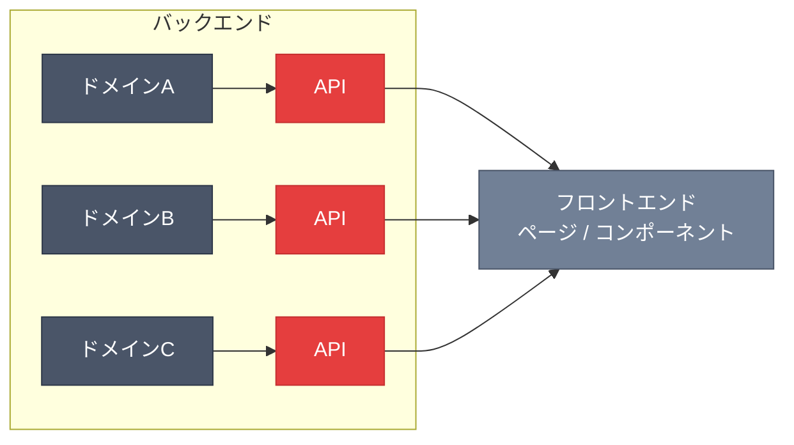
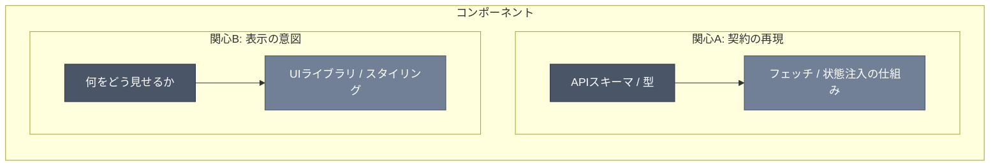

# フロントエンドにおけるクリーンアーキテクチャ

> **この原則は特定のフレームワークに依存しない。** React / Vue / Angular / Svelte / SolidJS など、いずれのフレームワークでも同様に適用できる。フレームワーク固有の例（Next.js App Router のディレクトリ構造など）は、後述のセクションで明示的に分離して示す。

## 前提

フロントエンドは、システム全体のクリーンアーキテクチャにおいて**最外縁（実装詳細）**に位置する。バックエンドのような「ドメインを中心に据えた単一の同心円」をフロントエンドに持ち込むことはできない。

しかし、クリーンアーキテクチャの原則が適用できないわけではない。**適用の仕方が異なるだけだ。**

---

## 核心：バックエンドとフロントエンドは地続きである

バックエンドとフロントエンドは別々のシステムではなく、**一つのアーキテクチャの内側と外側**にある。


バックエンドで切り出した各ドメインコンポーネントは、APIスキーマを通じてフロントエンドまで地続きに伸びる。フロントエンドの構造は、バックエンドのドメイン設計の帰結であり、フロントエンド独自のアーキテクチャを一から構想する必要はない。

**フロントエンドの設計に迷ったとき、問うべきは「フロントのアーキテクチャとして正しいか」ではなく、「バックエンドから伸びてきたドメインの構造に素直に従っているか」だ。**

---

## なぜフロントエンドは複雑に見えるか

バックエンドの複数のドメインコンポーネントが、それぞれAPIスキーマを通じてフロントエンドに到達する。フロントエンドの一つのページやコンポーネントは、これら**複数のドメインベクトルを同時に受け取り、組み合わせ、表示**する。



複数のベクトルが重なる地点にいるから、キメラのように複雑に見える。しかし構造が違うのではなく、同じ構造の見え方が違うだけだ。

---

## コンポーネントごとの小さなクリーンアーキテクチャ

フロントエンドでは、コンポーネント（関心の単位）ごとに小さなクリーンアーキテクチャが個別に展開される。各コンポーネントが抱える関心は主に以下の 2 つだ。

### 関心 A: 契約の再現および実行

バックエンドから受け取ったドメインの契約を、フロントエンド側で忠実に再現し実行する。

- 中心: 契約そのもの（APIスキーマ、型、ドメインルール）
- 実装詳細: フェッチ手段、キャッシュ戦略、状態管理ライブラリ

### 関心 B: どのように表示するか（how）

UIとしてどう見せるか、どう操作させるか。

- 中心: 表示の意図（何をどういう構造で見せたいか）
- 実装詳細: UIライブラリ、スタイリング手段、アニメーション

### 関心の独立性

これらの関心は**縦に積まれたレイヤーではなく、独立したベクトルとして並存**する。



「フェッチ / 状態注入の仕組み」は、フレームワークが提供する Context / Provider / Store / Signal など、関心 A の契約を届ける任意の手段を指す。

コンポーネントが関心 B から APIスキーマに直接依存しても、それは「層を飛ばしている」のではなく、**ベクトルが別であるだけ**だ。通る必要のない経路を通らなくてよい。

重要なのは依存の方向が一方向であることであり、「すべての層を順番に通ったか」は形式の話にすぎない。

---

## フロントエンドに統一的なレイヤー構造を敷かない理由

各コンポーネントが必要とする層は、ドメインによって動的に変わる。

- 表示するだけのコンポーネント → 関心 B の 1 ベクトル、層はほぼない
- バリデーション付きフォーム → 関心 A と B の 2 ベクトル
- 複雑な状態管理を伴う UI → 3 つ以上のベクトル

全体に均一なレイヤー構造（`API → Repository → UseCase → ViewModel → View` のような直列パイプライン）を強制すると、あるコンポーネントには不要な層が押し付けられ、別のコンポーネントには足りない層が生まれる。フロントエンドの関心は直列ではなく並列だ。

---

## ディレクトリ構造への反映

### 原則

1. **ドメイン（ルート）でトップレベルを切る** ― 技術的役割（`hooks/`, `utils/`, `components/`）ではなく、ドメインの関心でディレクトリを分ける
2. **コンポーネントが自身の構造を持つ** ― 各コンポーネントは必要に応じてフック、ユーティリティ、プロバイダ、テストを内包する。構造はドメインが要求する分だけ展開する
3. **APIスキーマは自動生成でバックエンドの契約を維持する** ― 手書きの型定義で契約を再実装しない
4. **共有ディレクトリは最小に保つ** ― ドメインに属さない純粋な汎用コードのみ

### 構造例（Next.js App Router — プロジェクト管理ツール）

> 以下はNext.js App Routerを使った場合の一例。`page.tsx` / `layout.tsx` / Server Actions といったファイル規約はNext.js固有だが、**「ドメインでトップレベルを切る」「コンポーネントが自身の構造を持つ」といった原則はフレームワークを問わず共通する。** Vue (Nuxt) なら `+page.svelte` ではなく `[id].vue`、Svelte (SvelteKit) なら `+page.svelte` が対応するが、構造上の原則は同じだ。

```txt
src/
├── types/
│   └── api-schema.ts              # バックエンドから自動生成された契約（境界）
│
├── app/
│   ├── layout.tsx                           # ルートレイアウト
│   └── project/[project_id]/
│       ├── layout.tsx                       # プロジェクト共通レイアウト
│       ├── page.tsx                         # プロジェクトトップページ
│       │
│       ├── _actions/                        # Server Actions（ドメインごと）
│       │   └── task-board/
│       │       ├── task.ts                  # 契約の実行
│       │       ├── task.test.ts
│       │       ├── column.ts
│       │       └── label.ts
│       │
│       ├── _components/                     # このドメインに属するUI
│       │   ├── project-chat/
│       │   │   ├── project-chat.tsx         # 表示の意図
│       │   │   ├── mention-selector/        # 子の関心
│       │   │   └── utils/
│       │   └── project-header/
│       │       ├── member-list/
│       │       └── archive-project-button/
│       │
│       ├── _utils/                          # このドメイン固有のユーティリティ
│       │   ├── calc-progress.ts
│       │   └── calc-progress.test.ts
│       │
│       └── board/[board_id]/
│           ├── layout.tsx                   # ボード共通レイアウト
│           └── task-board/                  # サブドメインがさらに展開
│               ├── page.tsx                 # タスクボードページ
│               ├── providers/               # このドメインの状態管理
│               │   ├── board-provider.tsx
│               │   └── task-filter-provider.tsx
│               ├── kanban-view/             # 表示の関心
│               │   ├── kanban-column/
│               │   └── utils/
│               ├── task-detail-panel/
│               ├── sort-button/
│               │   ├── sort-button.tsx
│               │   └── sort-button.test.tsx
│               └── task-comments/           # 複数の関心が重なる領域
│                   ├── comment-thread-provider/   # 契約の再現
│                   ├── comment-list/              # 表示の意図
│                   ├── task-activity-provider/
│                   └── task-activity-feed/
│                       └── activity-renderer/
│                           └── status-change-activity/
│                               ├── status-change-renderer.tsx
│                               ├── expanded-renderer/
│                               └── collapsed-renderer/
│
├── components/                     # ドメインに属さない純粋な汎用コンポーネント
│   └── ui/                         # shadcn 等のプリミティブ
│
└── lib/                            # ドメインに属さない純粋なユーティリティ
    ├── utils.ts
    ├── date.ts
    └── file.ts
```

### 構造の読み方

この構造で注目すべきは、**各コンポーネントが持つ内部構造がそれぞれ異なる**点だ。

| コンポーネント | 内包するもの | 理由 |
|---|---|---|
| `sort-button/` | `.tsx` + `.test.tsx` のみ | 表示の関心だけ。薄い |
| `kanban-view/` | `kanban-column/` + `utils/` | 表示が複雑。描画ユーティリティが必要 |
| `task-comments/` | provider, list, feed が多層に展開 | 契約の再現（comment-thread-provider）と表示（comment-list, activity-feed）の両ベクトルが重なる |
| `_actions/task-board/` | Server Actions + テスト | 契約の実行に特化。表示の関心なし |

これは「統一ルールで全コンポーネントを同じ構造にする」のではなく、**ドメインが要求する構造を素直に展開させた結果**だ。

---

## 判断基準

フロントエンドでの設計判断時に問うこと:

1. **このコンポーネントはどのドメインベクトルの延長にあるか？**
   - バックエンドのどのコンポーネントから伸びてきているかを辿る
2. **抱えている関心は何か？（契約の再現 / 表示の意図 / その両方）**
   - 関心ごとに依存方向が一方向であることを確認する
3. **今の構造はドメインが要求しているか、規約が要求しているか？**
   - 規約のために存在する層・ファイルは過剰構造の兆候
4. **通る必要のない経路を通していないか？**
   - 関心のベクトルが別なら、中間層を経由する必要はない

---

## 禁止事項

- フロントエンド全体に統一的なレイヤー構造（`repositories/`, `usecases/`, `viewmodels/`）を敷かない
- 「フロントエンド独自のドメインモデル」をバックエンドと別に定義しない（APIスキーマが契約）
- すべてのコンポーネントに同じ内部構造を強制しない
- 通る必要のない層を「レイヤードだから」という理由で追加しない
